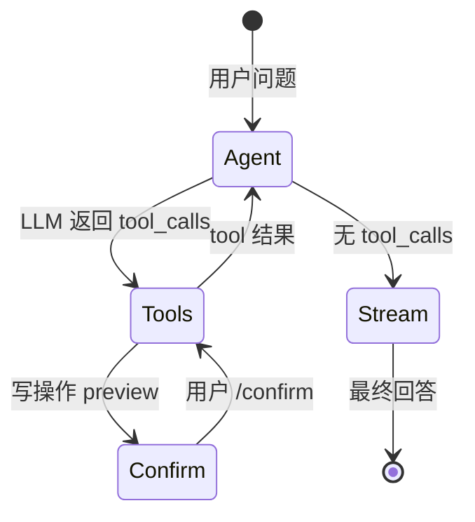

# Agent 演进路线 — gaosi-tutor 阶段 5 之后往哪走

> 手写 Agent + SSE + Session + 家庭笔记 RAG 已跑通。  
> 本文档整理**后续可选方向**、**框架对比**、**优先级建议**。  
> **不是必须全部做**——按目标和资源挑 1～2 条深入即可。

---

## 目录

1. [当前基线](#1-当前基线)
2. [为什么不急着换框架](#2-为什么不急着换框架)
3. [方向一：Agent 框架](#3-方向一agent-框架)
4. [方向二：可观测与评估平台](#4-方向二可观测与评估平台)
5. [方向三：RAG 工程化](#5-方向三rag-工程化)
6. [方向四：业务工具扩展](#6-方向四业务工具扩展)
7. [方向五：生产部署](#7-方向五生产部署)
8. [方向六：Multi-Agent](#8-方向六multi-agent)
9. [优先级建议](#9-优先级建议)
10. [渐进式迁移路径（若上框架）](#10-渐进式迁移路径若上框架)
11. [按目标的选型速查](#11-按目标的选型速查)
12. [相关文档](#12-相关文档)

---

## 1. 当前基线

gaosi-tutor 已具备：

```
用户 → SSE 流式 /api/chat/stream
         ↓
      loop.py（手写 tool 循环）
         ↓
      tools.py（list_lessons / get_lesson_context / search_family_notes / 出题 / 判题）
         ↓
      MySQL（session / messages / lesson_progress / practice_records）
         +
      Chroma（家庭笔记向量索引）
```

| 能力 | 实现 | 文档 |
|------|------|------|
| Tool Calling | 手写 `loop.py` | [agent-function-calling.md](./agent-function-calling.md)（MES 示例，概念通用） |
| RAG | Chroma + fastembed + `search_family_notes` | [agent-rag.md](./agent-rag.md) |
| 出题快捷路径 | `practice_flow.py` | [agent-learning-path.md](./agent-learning-path.md) §阶段 3 |
| SSE / Session | `router.py` + `session_store.py` | [agent-production.md](./agent-production.md)（部分 API 为 MES 示例） |
| 冒烟回归 | `make smoke` / `smoke-llm` / `smoke-rag` | [engineering.md](./engineering.md) |
| CI / 运维 | GitHub Actions + Makefile | [engineering.md](./engineering.md) |

**刻意未做（相对 MES）：** 写操作确认门、`agent_traces` 表、`agent_eval.py` 自动化评估。

**优势：** 每一层透明、可调试、可写 eval、面试/Demo 能讲清原理。  
**局限：** 复杂工作流、大规模 RAG、团队级观测需额外建设或引入框架。

---

## 2. 为什么不急着换框架

学习路线刻意采用 **「先手写，后框架」**：

| 手写阶段的价值 | 若一开始就上框架 |
|---------------|-----------------|
| 理解 `tool_calls` / messages 结构 | 容易当成黑盒 API |
| 确认门、Session 自己设计一遍 | 不知 Human-in-the-loop 在解决什么 |
| `agent_eval` 针对自己的 loop 写 | 框架升级可能导致行为漂移难查 |

**结论：** 当前 Demo **不必为「工程化」而推倒重写**。框架是**能力边界变大时**的工具，不是默认起点。

---

## 3. 方向一：Agent 框架

### 3.1 常见框架对照

| 框架 | 核心能力 | 与本项目的对应关系 | 迁移成本 |
|------|---------|-------------------|---------|
| **LangGraph** | 状态图、多步工作流、断点续跑、Human-in-the-loop | 最接近现有 `loop` + 确认门 | 中 |
| **LangChain** | 工具/RAG/链式调用/LCEL 生态 | 可替换 `tools` + `rag/retriever` | 中～高 |
| **LlamaIndex** | 文档索引、RAG 管线、Query Engine | 主要替换家庭笔记检索层 | 低～中（仅 RAG） |
| **OpenAI Agents SDK** | 官方 Agent + tool 循环 | 与现有 loop 结构相似 | 低 |
| **AutoGen / CrewAI** | 多 Agent 对话、角色分工 | 当前单 Agent 场景用不上 | 高 |
| **Semantic Kernel** | .NET/ Python 插件、Planner | 偏微软生态 | 高 |

### 3.2 什么时候值得引入

| 场景 | 建议 |
|------|------|
| 继续深入 Agent **原理** | 保持手写 |
| 工作流出现**多分支、并行、重试、子图** | 优先考虑 **LangGraph** |
| 家庭笔记量增大，需混合检索、重排 | **LlamaIndex** 或 Qdrant + 自研检索 |
| 团队已统一 **LangChain 生态** | 渐进迁移工具层与 RAG |
| Demo / 面试展示「能讲清原理」 | **不必换** |

### 3.3 LangGraph 与现有架构映射（示例）



节点可对应：`chat_with_tools` → `execute_tool` → `pending_confirmation` → `chat_stream`。

---

## 4. 方向二：可观测与评估平台

在已有 `agent_traces` + `agent_eval` 基础上，可对接专业平台。

| 工具 | 作用 | 是否要换 loop |
|------|------|--------------|
| **Langfuse** | trace、prompt 版本、成本、延迟、用户反馈 | **否**，OpenTelemetry/SDK 埋点 |
| **LangSmith** | LangChain 生态观测、数据集、实验 | 偏 LangChain 项目 |
| **Phoenix (Arize)** | RAG 检索质量、embedding 可视化 | **否**，RAG 层增强 |
| **Promptfoo** | prompt A/B、 red-team | **否**，独立 CLI |
| **Weights & Biases** | 实验跟踪 | 可选 |

### 4.1 可做的增强（不依赖框架）

| 项 | 说明 |
|----|------|
| eval 结果持久化 | 每次 `agent_eval` 写入表，对比历史 pass rate |
| prompt 版本号 | `prompts.py` 加 `PROMPT_VERSION`，trace 里记录 |
| 成本统计 | trace 里加 `prompt_tokens` / `completion_tokens` |
| 用户反馈 | 前端 👍/👎 → 关联 `request_id` |

**特点：** 性价比通常 **高于** 整体换框架。

---

## 5. 方向三：RAG 工程化

当前实现见 [agent-rag.md](./agent-rag.md)：

- chunk 来自 `lesson_progress.family_notes`（家长自写）
- 向量存 **Chroma 持久化**（`data/chroma`）
- **fastembed 本地向量检索**（`BAAI/bge-small-zh-v1.5`）

### 5.1 升级项

| 升级 | 价值 | 复杂度 |
|------|------|--------|
| **混合检索**（BM25 + 向量） | 「借位」等精确词 + 语义 | 中 |
| **Reranker**（如 bge-reranker） | 减少 LLM 多次调 `search_family_notes` | 中 |
| **RAG 评测集** | 固定 10 问测 Recall@K | 低 |
| **索引同步** | 笔记变更已单讲 reindex；可加 startup 全量校验 | 低 |
| **换 Qdrant / pgvector** | 多实例部署、更大规模 | 中 |

> Chroma 持久化 **已完成**；下一步性价比最高的是 **评测集 + 混合检索**（见 [enterprise-rag-roadmap.md](./enterprise-rag-roadmap.md)）。

### 5.2 与框架的关系

- **只升级 RAG**：用 LlamaIndex 或 LangChain Retriever **单独替换** `rag/retriever.py`，`loop` 不动。
- 这是**业务体感最明显**、**风险相对可控**的演进路径之一。

---

## 6. 方向四：业务工具扩展

Agent 价值来自 **陪学业务覆盖**，而非 loop 多复杂。

| 工具（规划） | 包装 | 类型 | 说明 |
|-------------|------|------|------|
| `get_learning_stats` | 聚合 `practice_records` | 只读 | 「这周哪里薄弱」 |
| `suggest_review_plan` | 基于错题讲次 | 只读 | 复习计划建议 |
| `update_family_notes` | 家长模式写笔记 | 写 | 可走 tool 或保留 REST |
| Coach / Practice / Analyst | 多 Agent 分工 | 编排 | 见 [agent-learning-path.md](./agent-learning-path.md) 阶段 8 |

### 6.1 实施注意

- 本项目 **无 MES 式确认门**；若加高风险写操作再引入 preview/confirm
- 每加一个 tool：**补 1～2 条 `smoke-llm` 或人工 eval 场景**
- 业务逻辑放 `tools.py` / `curriculum/` / `session_store.py`，Agent 层只编排

---

## 7. 方向五：生产部署

当前：[engineering.md](./engineering.md) 已覆盖 CI、MySQL、Makefile、健康检查。

### 7.1 进一步生产化

| 项 | 说明 |
|----|------|
| **全栈 Docker Compose** | backend + frontend(Nginx 静态) + mysql 一键起 |
| **多环境配置** | `config/.env.dev` / `.env.prod`，禁止密钥入库 |
| **HTTPS / 反向代理** | Nginx / Caddy |
| **进程守护** | systemd、supervisord、K8s Deployment |
| **日志聚合** | JSON log → Loki / ELK（可选） |
| **备份** | MySQL 定时 dump |
| **限流 / 鉴权** | API Key 或 JWT，Agent 写操作加角色 |

### 7.2 Agent 特有部署注意

| 项 | 说明 |
|----|------|
| LLM API 密钥 | 仅服务端，经环境变量注入 |
| SSE 长连接 | Nginx 需 `proxy_buffering off`（与现 `X-Accel-Buffering: no` 一致） |
| `confirm_store` 内存 | 多实例部署需改 Redis 等共享存储 |
| RAG 持久化 | 多 worker 共享 Chroma 目录或换 Qdrant | ✅ Chroma 本地已做 |

---

## 8. 方向六：Multi-Agent

```
用户 → 计划 Agent → 查询 Agent → 执行 Agent → 汇总 Agent
```

| 适合 | 不适合（当前 Demo） |
|------|---------------------|
| 角色清晰、流程极长 | 「查工单 + 创建下达」单链路 |
| 不同团队维护不同 Agent | 工具数 < 15、单 domain |
| 需要「专家辩论」式决策 | 延迟敏感、要简单可测 |

**建议：** 除非出现明确的**多角色分工需求**，否则 **单 Agent + 多工具** 更简单、更好测、更好 eval。

若实验：可用 LangGraph **子图** 或 CrewAI 做 POC 分支，与主线并行，不替换现有 `/chat/stream`。

---

## 9. 优先级建议

### 9.1 通用推荐（工程化 + 成长）

按 **性价比** 排序：

```
1. RAG 评测集 + 混合检索（BM25 兜底）     ← 笔记检索质量提升明显
2. 可观测（traces / Langfuse）           ← 调试多步 tool
3. 学情 tool（practice_records 聚合）    ← 更像真陪学产品
4. 复杂分支出现时再引入 LangGraph        ← 按需迁移
5. Multi-Agent（Coach/Practice/Analyst） ← 见 agent-learning-path 阶段 8
```

### 9.2 按个人目标

| 你的目标 | 建议路径 |
|---------|---------|
| **深入 Agent 原理** | 保持手写；加 eval 用例；读 LangGraph 文档但不迁 |
| **简历/面试（原理 + 框架）** | 开分支用 LangGraph 复现确认门；写对比文档 |
| **简历/面试** | 家庭笔记 RAG + 手写 loop + smoke 回归；对照 [enterprise-rag-roadmap.md](./enterprise-rag-roadmap.md) |
| **陪学产品迭代** | 学情统计 + RAG 混合检索 + 前端家长报表 |
| **团队统一 LangChain** | 渐进迁移：RAG → tools → graph |
| **5 分钟 Demo 已够用** | 维持现状，偶尔 `make eval-llm` 回归 |

### 9.3 不建议做的事

| 不建议 | 原因 |
|--------|------|
| 推倒重写为 LangChain | 现有 eval/trace 作废，学习收益递减 |
| 第一天 Multi-Agent | 复杂度陡增，难 debug |
| 无 eval 加工具 | 容易悄悄退化 |
| 框架版本追新 | Demo 项目稳定性优先 |

---

## 10. 渐进式迁移路径（若上框架）

**原则：** `services.py` 不动，自外向内替换。

```
阶段 A — 保持 loop
  └─ 接入 Langfuse（trace）

阶段 B — 只换 RAG
  └─ 混合检索 / Rerank 增强 retriever.py
  └─ search_family_notes 工具接口不变

阶段 C — 换编排（可选）
  └─ LangGraph 复现：tools → confirm → stream
  └─ agent_eval 10 问仍须 PASS

阶段 D — 观测与 prompt 实验
  └─ Langfuse datasets + prompt 版本
  └─ 或 Promptfoo 做 prompt A/B
```

每阶段：**单独 PR + eval 全绿 + 文档更新**。

---

## 11. 按目标的选型速查

| 需求 | 首选 | 备选 |
|------|------|------|
| Human-in-the-loop 状态机 | LangGraph | 继续手写 loop |
| 向量 RAG | Chroma + fastembed（已实现） | Qdrant / pgvector |
| 调用链路 trace | Langfuse | 扩展 MySQL traces 表 |
| Prompt 实验 | Promptfoo | 改 prompts.py + 人工对比 |
| 多 Agent 编排 | LangGraph / 手写 Orchestrator | — |
| 仅陪学业务扩展 | 手写 tools | — |

---

## 12. 相关文档

| 文档 | 内容 |
|------|------|
| [agent-learning-path.md](./agent-learning-path.md) | gaosi-tutor 主学习路线 |
| [agent-rag.md](./agent-rag.md) | 家庭笔记 RAG |
| [vector-db-learning.md](./vector-db-learning.md) | 向量库原理与选型 |
| [agent-production.md](./agent-production.md) | 流式、Session（部分 MES API 示例） |
| [engineering.md](./engineering.md) | CI、部署、Makefile |
| [enterprise-rag-roadmap.md](./enterprise-rag-roadmap.md) | 企业级 RAG 对照 |

---

## 附录：可选 POC 清单（供排期）

复制到 Issue / 看板：

```
[ ] RAG 固定 10 问评测集 + Recall 报告
[ ] 混合检索（BM25 + 向量）POC
[ ] agent traces 或 Langfuse 接入
[ ] get_learning_stats tool + 家长学情页
[ ] LangGraph 重写 practice_flow 对照实验
[ ] Docker 全栈 compose（backend + frontend + mysql）
```

---

> **当前建议：** 以现有手写 Agent 为底座，优先 **RAG 评测 + 混合检索** 或 **学情 tool**；框架在 workflow 明显变复杂时再引入 LangGraph。
