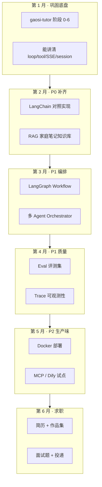

# Agent 开发工程师求职学习路线（BOSS 直聘调研版）

> **调研时间**：2026-07  
> **数据来源**：BOSS 直聘为主，交叉参考智联/猎聘/牛客/高校就业网；并参考 [50+ 真实 JD 分析](https://juejin.cn/post/7644822313692692518)  
> **定位**：面向 **Agent 应用开发工程师**（非算法/训练岗），学完可对标市场主流招聘要求  
> **实战载体**：以 [gaosi-tutor](../README.md) 为主线项目，逐步补齐简历关键词与工程深度

---

## 一、BOSS 直聘调研结论

### 1.1 岗位名称（搜索关键词）

在 BOSS 直聘上，同一类岗位有多种叫法，建议同时搜：

| 关键词 | 岗位量 | 说明 |
|--------|--------|------|
| AI 应用开发工程师 | 最多 | 覆盖面最广 |
| Agent 开发工程师 / AI 智能体开发工程师 | 增长最快 | 与本路线最直接对口 |
| 大模型应用开发工程师 | 中高级偏多 | 强调 LLM 落地 |
| Python 大模型开发（LangChain） | 外包/集成商常见 | 关键词堆砌型 JD |
| AI 开发工程师（Dify 方向） | 上升中 | 低代码 + 编排 |

### 1.2 学历与经验门槛（BOSS + 全网样本）

| 维度 | 占比（估算） | 说明 |
|------|-------------|------|
| 本科及以上 | ~60% | 主流底线；**应用岗**对双非相对友好 |
| 硕士及以上 | ~25% | 大厂/研究味重的岗 |
| 3 年+ 经验 | ~30% | 社招主流 |
| 1～3 年 | ~25% | 初中级 |
| 应届/实习 | ~20% | 校招、实习转正 |
| 项目驱动、经验不限 | ~25% | 「2 个以上非玩具级 Agent 项目」类描述增多 |

**薪资（一线城市，2026 参考）**：

| 层级 | 月薪 |
|------|------|
| 应届/实习 | 8k～15k |
| 1～2 年 | 12k～25k |
| 3～5 年 | 20k～40k |
| 5 年+/专家 | 30k～60k+ |

### 1.3 技能出现频率（50+ JD 交叉统计）

| 技能 | 频率 | 招聘方真实意图 |
|------|------|----------------|
| **Python** | ~100% | 必备门槛 |
| **LangChain** | ~80% | 简历关键词 + 工程抽象；会问 Chain/Agent/Tool/Memory |
| **RAG** | ~60% | 企业知识库、客服、文档问答——几乎标配 |
| **Prompt Engineering** | ~45% | CoT、Few-shot、结构化输出、版本管理 |
| **向量数据库** | ~40% | Milvus / Qdrant / Chroma，与 RAG 绑定 |
| **Dify / Coze** | ~35% | 快速原型、工作流编排、企业交付 |
| **LangGraph** | ~25% | 复杂 Workflow、状态机、多步编排 |
| **LLM API 应用** | ~70% | 调 API、流式、成本控制，不等于会训练 |
| **FastAPI** | ~20% | 后端接口、与前端联调 |
| **AutoGen / CrewAI** | ~15% | 多 Agent 协作 |
| **Docker / K8s** | ~20%（高级岗更高） | 部署与可扩展 |
| **MCP** | ~10% | 2025～2026 新兴加分项 |
| **模型微调 / PyTorch** | ~30%～35% | **高级/算法味岗**才硬要求；应用岗「了解即可」 |

### 1.4 岗位职责高频句式（拆解后）

招聘 JD 看起来杂，本质在问你能不能交付这几件事：

```
1. 设计 Agent 架构：规划、记忆、工具调用、意图识别
2. 搭建 RAG：文档解析 → 向量检索 → 重排序 → 生成
3. Workflow 编排：多步任务、分支、异常重试
4. 多 Agent 协作：角色分工、任务分解、结果汇总
5. 工程化落地：API、流式、会话、监控、成本、安全
6. 效果迭代：Prompt 版本管理、评测集、线上 bad case
```

### 1.5 招聘方不太在乎 vs 很在乎

| 不太在乎（应用岗） | 很在乎 |
|-------------------|--------|
| 发论文、推导公式 | 端到端项目能演示 |
| 精通所有大模型 | 熟悉 1～2 个 API + 国产模型适配 |
| 从零预训练 | Tool Calling、RAG、Workflow 跑通 |
| 背框架 API | 说清为什么这样设计、失败怎么处理 |
| LeetCode Hard | 基础算法 + 系统设计（会话、并发、缓存） |

---

## 二、岗位能力模型（对标招聘）

把 JD 翻成可练的能力树，分 P0 / P1 / P2：

### P0 — 面试必问，简历必写

| 能力 | 招聘关键词 | gaosi-tutor 现状 | 差距 |
|------|-----------|------------------|------|
| Python 工程 | Python 精通 | ✅ FastAPI + 脚本 | 补异步、类型标注、测试 |
| LLM API | DeepSeek/OpenAI 兼容 | ✅ `llm.py` | 补多模型切换、重试、超时 |
| Tool Calling | Function Calling | ✅ 手写 loop + 4 tools | 需能用 LangChain 讲同一套 |
| Prompt Engineering | CoT、Few-shot、结构化输出 | ✅ 双 prompt + tool 内 prompt | 补版本管理、Eval 对比 |
| Agent 基础架构 | ReAct、规划、记忆 | ✅ loop + session | 补长期记忆、意图路由 |
| RAG 基础 | 向量检索 + 知识库 | ❌ Phase 2 未做 | **求职最大缺口** |
| LangChain 使用 | Chain / Agent / Memory | ❌ 手写为主 | **简历关键词缺口** |
| 项目落地 | 0→1、非玩具级 | ✅ 真实陪学场景 | 补监控、评测、文档 |

### P1 — 大部分 JD 会写，决定你能否过初筛

| 能力 | 招聘关键词 | 建议落点 |
|------|-----------|----------|
| FastAPI + SSE | 流式 API、WebSocket | gaosi-tutor 已有，写进简历 |
| LangGraph | 状态机 Workflow | 用 LangGraph 重做 `practice_flow` |
| 向量数据库 | Milvus / Qdrant / Chroma | 家庭笔记 RAG |
| 多 Agent | AutoGen / CrewAI / 手写 Orchestrator | Coach + Practice + Analyst |
| Eval | LangSmith / 自建 benchmark | `scripts/eval/` + 冒烟扩展 |
| Dify | 低代码 Agent 平台 | 用 Dify 复刻一版陪学 demo 作对比 |
| 可观测性 | trace、延迟、tool 成功率 | 恢复 `agent_traces` |

### P2 — 加分项，中级岗以上

| 能力 | 何时学 |
|------|--------|
| Docker / Compose 部署 | 项目容器化一键启动 |
| MCP 协议 | Tool 对外暴露标准化 |
| 混合检索 + Rerank | RAG 进阶 |
| 模型路由 / 成本优化 | 出题用小模型、答疑用大模型 |
| 微调入门 | 仅投高级岗时补 |
| 前端全栈 | Vue 经验可写「能独立联调」 |

---

## 三、总路线：6 个月达到招聘要求



**原则**：不是学完框架再找工作，而是 **每 2 周往 gaosi-tutor 里长一块能力**，简历始终有东西可写。

---

## 第 1 月：巩固底盘（对标 P0 的工程底子）

> 对应 [agent-learning-path.md](./agent-learning-path.md) 阶段 0～6

### 学习目标

- 能手绘请求链路：`router → loop → tools → llm → SSE → session`
- 能口述 ReAct：Reasoning（选 tool）→ Action（执行）→ Observation（结果回注）→ 最终回答
- 能解释 `practice_flow.py` 为什么是 Workflow 而不是 Agent

### 实战任务

| 周 | 任务 | 简历可写 |
|----|------|----------|
| W1 | 跑通 + 改 prompt + smoke | 熟悉 LLM 应用开发流程 |
| W2 | 读透 `loop.py` / `tools.py`，画时序图 | 理解 Tool Calling 与嵌套 LLM |
| W3 | 读 `router.py` + 前端 SSE，抓包分析 | 流式 Agent API 设计与实现 |
| W4 | 扩展 smoke_test：出题 + 判题断言 | Agent 自动化冒烟测试 |

### 面试达标线

能回答：

1. Tool Calling 的消息结构长什么样？`tool_calls` / `role: tool` 如何配合？
2. 为什么限制 `HISTORY_LIMIT`？怎么权衡记忆与成本？
3. 流式 SSE 有哪些事件类型？前端如何处理 tool 与 text 交错？

---

## 第 2 月：P0 补齐 — LangChain + RAG（求职最大缺口）

> BOSS 上 ~80% JD 写 LangChain，~60% 写 RAG——这两项必须出现在简历上

### 2.1 LangChain 对照模块（不推翻主路径）

在 `backend/app/agent/experimental/` 做 **对照实验**，主路径仍用手写 loop：

```
experimental/
├── langchain_agent.py      # 同一 4 tools，用 LangChain Agent 实现
├── langchain_rag.py        # 家庭笔记 RAG Chain
└── compare_smoke.py        # 同一输入，对比手写 vs LangChain
```

**要掌握的 LangChain 面试点**：

| 概念 | 对应 gaosi-tutor |
|------|------------------|
| ChatModel | `llm.py` |
| Tools + bind_tools | `tools.py` TOOLS |
| AgentExecutor / 自建 loop | `loop.py` |
| Memory / ChatMessageHistory | `session_store.py` |
| LCEL Chain | `generate_practice` 内部流水线 |
| Structured Output | `_parse_json_from_llm` |

**验收**：面试时能讲「我项目里主路径是手写 loop，我也用 LangChain 做过对照，说清两者取舍」。

### 2.2 RAG：家庭笔记知识库（BOSS 标配项目点）

按 JD 要求实现完整 RAG 管线：

```
家长笔记 / 错题摘要
  → 文档切块（chunk）
  → Embedding（bge / openai 兼容）
  → 向量库（建议 Qdrant 或 Chroma，轻量易演示）
  → 检索（Top-K + 可选混合检索）
  → 注入 prompt / 或 Agentic 检索 tool
```

**建议新增**：

| 模块 | 路径 |
|------|------|
| RAG 管线 | `backend/app/agent/rag/` |
| 检索 Tool | `search_family_notes` 加入 TOOLS |
| 管理 API | `POST /api/notes/index` |
| 前端 | 家长模式「索引笔记」按钮 |

**简历写法示例**：

> 基于 LangChain + Qdrant 构建家庭笔记 RAG，支持讲次维度过滤检索，陪学 Agent 答疑准确率提升 X%（用 Eval 集测）

### 2.3 Prompt Engineering 体系化

| 任务 | 产出 |
|------|------|
| Prompt 版本文件化 | `prompts/v1_child.txt`、`v2_child.txt` |
| 评测对比 | 同一题集跑 v1/v2，记录胜率 |
| 结构化输出 | 出题/判题 JSON schema 约束 |

---

## 第 3 月：P1 — Workflow 编排 + 多 Agent

### 3.1 LangGraph Workflow（对标 ~25% JD）

用 LangGraph 实现至少一条生产级流程：

| 流程 | 节点 |
|------|------|
| 练习回合 | `generate` → `present` → `wait_answer` → `evaluate` → `feedback` |
| 学情复习 | `load_stats` → `find_weak` → `plan` → `notify_parent` |

目录：`backend/app/agent/workflows/` + `experimental/langgraph_practice.py`

**面试点**：StateGraph、checkpoint、条件边、异常重试——对照 `practice_flow.py` 讲清为什么图更适合复杂分支。

### 3.2 多 Agent（对标 ~15% JD，但面试爱问）

| Agent | 职责 | Tools |
|-------|------|-------|
| Coach | 苏格拉底答疑 | `get_lesson_context`, `search_family_notes` |
| Practice | 出题判题 | `generate_practice`, `evaluate_answer` |
| Analyst | 学情报告 | `get_learning_stats`, `list_lessons` |

`orchestrator.py`：规则 + 轻量意图分类 → 分发子 Agent。

**简历写法**：

> 设计 Coach/Practice/Analyst 三 Agent 分工，Orchestrator 基于意图路由，共用统一 loop 引擎与 Session 存储

### 3.3 Dify 低代码对照（可选，1 周）

BOSS 上 ~35% JD 提 Dify。不必主项目迁移，建议：

- 用 Dify 搭一版「陪学问答」工作流
- 写对比笔记：Dify vs 手写 vs LangGraph 的适用边界

---

## 第 4 月：P1 — Eval + 可观测性（区分 Demo 与生产）

招聘方越来越常问：**你怎么证明 Agent 好用？线上出问题怎么查？**

### 4.1 Eval 评测集

```
backend/scripts/eval/
├── golden_set.jsonl     # 50～100 条：讲次、问题、期望行为
├── run_eval.py          # 批量跑 Agent，记录 tool 命中、延迟
└── llm_judge.py         # LLM-as-Judge 评回复质量（可选）
```

**指标**：

| 指标 | 说明 |
|------|------|
| tool 命中率 | 「出题」是否调 `generate_practice` |
| 答案正确率 | 判题与人工标注一致率 |
| 平均延迟 | P50 / P95 |
| Token 成本 | 每会话平均消耗 |

### 4.2 Trace 可观测性

恢复/新增 `agent_traces` 表，记录每轮：llm_turns、tool、ms、ok、session_id。

对标 JD 里的 LangSmith / 自建监控——面试画得出「工具调用成功率、错误率、延迟」看板即可。

---

## 第 5 月：P2 — 生产味 + 新兴协议

| 任务 | 对标 JD | 产出 |
|------|---------|------|
| Docker 一键部署 | Docker/K8s | `Dockerfile` + 更新 compose |
| MCP Server | MCP ~10% | 把 `list_lessons` 等暴露为 MCP Tool |
| 模型路由 | 成本优化 | 出题用 deepseek-chat，简单分类用小模型 |
| 安全 | Prompt 注入防护 | 输入过滤 + 话题限定（陪学已有基础） |
| 混合检索 + Rerank | 高级 RAG 岗 | 笔记 RAG 加 BM25 + Reranker |

---

## 第 6 月：求职冲刺

### 6.1 简历项目描述模板（gaosi-tutor）

```
高思陪学 Agent（gaosi-tutor）| 独立开发 | Python / FastAPI / Vue
· 设计并实现基于 DeepSeek 的陪学 Agent：Tool Calling、SSE 流式、Session 持久化
· 手写 Agent Loop + LangChain/LangGraph 对照实验，支撑答疑/出题/判题多步推理
· 搭建家庭笔记 RAG（LangChain + Qdrant），讲次维度检索增强陪学上下文
· 多 Agent 架构（Coach/Practice/Analyst）+ Orchestrator 意图路由
· 建立 Eval 黄金集（N 条）与 trace 监控，tool 命中率 X%，判题一致率 Y%
· 支持语音 I/O、结构化 SVG 配图出题；Docker 一键部署
```

### 6.2 面试高频题（按 BOSS 面经整理）

**基础**

1. ReAct 是什么？和你项目里的 loop 怎么对应？
2. Tool Calling 底层消息格式？多 tool 并行怎么处理？
3. RAG 全流程？幻觉怎么缓解？
4. LangChain 的 Chain、Agent、Memory 分别解决什么问题？

**进阶**

5. LangGraph 和手写 Workflow 的区别？
6. 多 Agent 如何分工？如何避免 Agent 互相打架？
7. 上下文窗口不够怎么办？记忆压缩策略？
8. 如何评测 Agent？有哪些指标？
9. Prompt 注入怎么防？
10. 如何降低 LLM 调用成本？

**项目深挖（必准备）**

11. 为什么「出题」要走 `practice_flow` 捷径？
12. `evaluate_answer` 为什么用 LLM 判而不是规则？
13. 如果 tool 调用失败，你的系统怎么处理？
14. 流式输出时 tool 和 text 的顺序如何保证？

### 6.3 投递策略（BOSS 直聘）

| 策略 | 说明 |
|------|------|
| 搜索词 | Agent开发、大模型应用、LangChain、RAG、Python AI |
| 公司类型 | AI 中小厂、传统企业 AI 部门（竞争小于大厂） |
| 作品 | GitHub README 含：架构图、演示 GIF、Eval 结果、技术栈关键词 |
| 节奏 | 先投 20 家练手 → 根据面试反馈补缺口 → 再投目标公司 |

---

## 四、能力 ↔ 项目模块对照总表

| 招聘要求 | 学完标志 | gaosi-tutor 落点 | 阶段 |
|----------|----------|------------------|------|
| Python | 能写测试、异步 API | 全项目 | 第 1 月 |
| LLM API | 多模型、重试、流式 | `llm.py` 增强 | 第 1 月 |
| Tool Calling | 能讲清消息协议 | `tools.py` + `loop.py` | 第 1 月 |
| Prompt Engineering | 版本化 + Eval | `prompts.py` + eval | 第 2 月 |
| LangChain | 能对照实现 | `experimental/langchain_*` | 第 2 月 |
| RAG | 完整管线可演示 | `agent/rag/` | 第 2 月 |
| FastAPI + SSE | 生产级接口 | `router.py` + 前端 | 第 1 月 |
| LangGraph | 至少 1 条状态图 | `workflows/` | 第 3 月 |
| 多 Agent | 3 角色 + 路由 | `orchestrator.py` | 第 3 月 |
| Dify | 能讲平台边界 | 对照 demo | 第 3 月 |
| Eval | 黄金集 + 指标 | `scripts/eval/` | 第 4 月 |
| 可观测性 | trace 可查 | `agent_traces` | 第 4 月 |
| Docker | 一键部署 | Dockerfile | 第 5 月 |
| MCP | 能演示 1 个 Tool | `experimental/mcp/` | 第 5 月 |

---

## 五、与「陪学学习路线」的关系

| 文档 | 侧重 |
|------|------|
| [agent-learning-path.md](./agent-learning-path.md) | 以 **读懂、改好 gaosi-tutor** 为主线 |
| **本文档** | 以 **达到 Agent 开发工程师招聘要求** 为主线 |

建议并行：

1. 按 `agent-learning-path.md` 阶段 0～6 打牢项目理解（第 1 月）
2. 按本文档第 2～5 月往项目 **叠加** LangChain、RAG、LangGraph、Eval
3. 第 6 月用 **同一个 repo** 投递——项目深度比项目数量更重要

---

## 六、一句话总结

BOSS 直聘上的 Agent 开发岗，要的不是「会背 LangChain API」，而是：

> **能独立交付：LLM + Tool + RAG + Workflow + 多 Agent + 流式 API + 评测监控**

gaosi-tutor 已经覆盖其中 **约 50%**（Tool、Loop、Prompt、SSE、Session、Workflow 雏形）。按本路线再补 **LangChain、RAG、LangGraph、Eval、Trace** 五个月，就能把「家庭项目」包装成 **对标招聘的 Agent 工程作品集**。

---

## 参考资料

- [50+ 真实 JD 分析（含 BOSS 直聘）](https://juejin.cn/post/7644822313692692518)
- [gaosi-tutor 设计文档](./design.md)
- [gaosi-tutor 项目内学习路线](./agent-learning-path.md)
- [AgentGuide 求职路线](https://github.com/adongwanai/AgentGuide)（开源社区补充）
