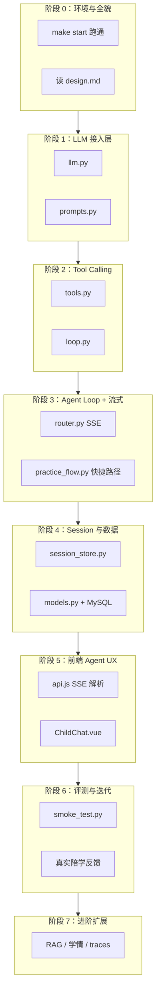
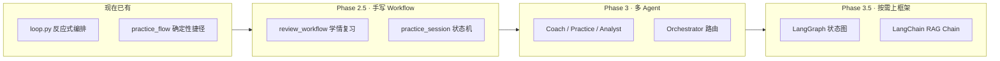

# gaosi-tutor Agent 学习路线

> 基于本仓库代码与设计文档整理的实战学习路径。  
> 前置：已在 [MES Demo](../mes) 走过 Tool Calling、SSE、Session、Eval 基础课。  
> 本文档目标：把同一套 Agent 工程能力，在陪学场景里「能跑通 → 能改 → 能扩展」。

---

## 总览



**核心心智模型**：

```
Agent = System Prompt + 消息历史 + Tool 定义 + 循环执行 + 持久化 + 流式 UX
```

---

## 进度 Checklist

复制到你的笔记里，学完一项勾一项。

### 阶段 0：环境与全貌

- [ ] `make install && make db-up && make init-db && make start` 跑通
- [ ] `make smoke`（不调 LLM）通过
- [ ] `make smoke-llm`（需 API Key）通过
- [ ] 读过 [design.md](./design.md) 第 5～7 节
- [ ] 孩子模式点「出一道题」能看到流式回复
- [ ] 家长模式能切换讲次、难度

### 阶段 1：LLM 接入层

- [ ] 读过 `backend/app/agent/llm.py`
- [ ] 读过 `backend/app/agent/prompts.py`
- [ ] 能解释 `chat` / `chat_stream` / `chat_with_tools` 三种调用的区别
- [ ] 动手：改一条 CHILD_PROMPT 规则，观察回复变化
- [ ] 动手：Swagger 调 `POST /api/chat` 看非流式响应
- [ ] 动手：写家庭笔记，确认注入到 system prompt

### 阶段 2：Tool Calling

- [ ] 读过 `backend/app/agent/tools.py` 四个 Tool 定义
- [ ] 能解释「主 loop 调 tool」与「tool 内部再调 LLM」的两层结构
- [ ] 动手：`generate_practice` prompt 加约束，跑 `make smoke-llm`
- [ ] 动手：传错 `lesson_id`，观察 `ok: false` 如何向上传递
- [ ] 动手：查 `practice_records` 表，确认出题/作答有落库

### 阶段 3：Agent Loop + SSE

- [ ] 读过 `backend/app/agent/loop.py`（同步 + 流式两版）
- [ ] 读过 `backend/app/agent/router.py` 的 `/api/chat/stream`
- [ ] 读过 `backend/app/agent/practice_flow.py` 快捷路径
- [ ] 能解释 SSE 事件：`tool_start` / `tool_end` / `delta` / `done`
- [ ] 能解释「出题」为何有快捷路径（可靠性 > 纯 Agent 决策）
- [ ] 动手：Network 面板看 `text/event-stream` 原始帧

### 阶段 4：Session 与持久化

- [ ] 读过 `backend/app/agent/session_store.py`
- [ ] 读过 `backend/app/models.py` 三张核心表
- [ ] 能解释 `HISTORY_LIMIT=12` 的作用
- [ ] 动手：聊 15 轮，确认早期消息被截断
- [ ] 动手：清空 `localStorage` session_id，观察新 session 创建

### 阶段 5：前端 Agent UX

- [ ] 读过 `frontend/src/api.js` 的 SSE 解析
- [ ] 读过 `frontend/src/views/ChildChat.vue`
- [ ] 读过 `frontend/src/components/MathDiagram.vue`
- [ ] 动手：第 4 讲出题，确认配图渲染
- [ ] 动手：Chrome 走一遍语音输入 + TTS 播报

### 阶段 6：评测与迭代

- [ ] 每次改 prompt/tool 后跑 `make smoke` + `make smoke-llm`
- [ ] 建立 5 个固定人工 Eval 场景（答疑/出题/答对/答错/超纲）
- [ ] 记录 10 次真实陪学问题，归类改法（prompt / tool / loop / 前端）

### 阶段 7：进阶扩展（Phase 2）

- [ ] 学情报表：聚合 `practice_records`
- [ ] RAG：家长自写要点索引（`make smoke-rag`，读 agent-rag.md）
- [ ] Agent Traces：全链路可观测
- [ ] Eval 自动化：golden dataset + LLM-as-judge

### 阶段 8：编排 / Workflow / 多 Agent / 框架

- [ ] 能区分「手写 loop」「确定性 workflow」「多 Agent」「框架」各自适用场景
- [ ] 读过 `practice_flow.py`，理解本项目已有的 workflow 雏形
- [ ] 动手：用纯 Python 实现 `review_workflow`（学情 → 薄弱讲次 → 复习建议）
- [ ] 动手：拆出 Coach / Practice / Analyst 三个子 Agent（仍用手写 loop）
- [ ] 选型：对比 LangGraph vs 继续手写，记录决策理由
- [ ] （可选）用 LangGraph 重写 `practice_flow` 作为对照实验

---

## 阶段 0：先跑起来，建立地图（~半天）

| 动作 | 命令 / 文件 |
|------|-------------|
| 启动全栈 | `make install` → `make db-up` → `make init-db` → `make start` |
| 冒烟（不调 LLM） | `make smoke` |
| 冒烟（调出题链路） | `make smoke-llm` |
| 读设计 | [design.md](./design.md) 第 5～7 节 |

**对照 MES**：架构图与 MES 几乎一一对应，业务从「工单/工位」换成「讲次/练习」。

---

## 阶段 1：LLM 接入层（~1 天）

### 核心文件

| 文件 | 职责 |
|------|------|
| `backend/app/agent/llm.py` | `chat` / `chat_stream` / `chat_with_tools` |
| `backend/app/agent/prompts.py` | child / parent 双 system prompt，动态注入讲次与笔记 |

### 要搞懂的概念

1. **OpenAI 兼容 API**：DeepSeek 用 `OpenAI` SDK，`base_url` 指向 DeepSeek。
2. **三种调用模式**：
   - `chat`：一次性完整回复（tool 内部出题/判题用）
   - `chat_stream`：逐 token 流式（最终回答给用户）
   - `chat_with_tools`：让模型决定是否调工具
3. **System Prompt 工程**：同一 Agent，不同 `mode` 换不同人格与规则。

### 动手练习

1. 在 `prompts.py` 给 `CHILD_PROMPT` 加一条规则（如「每句不超过 15 字」），重启后端对比。
2. Swagger（`http://localhost:8000/docs`）调 `POST /api/chat`，观察完整 JSON。
3. 家长模式写 `family_notes`，确认 prompt 出现 `【家庭笔记】` 块。

### 验收标准

能解释：**为什么出题/判题在 tool 里再调一次 `chat`，而不是只靠主 loop？**

---

## 阶段 2：Tool Calling（~1～2 天）

### 核心文件

`backend/app/agent/tools.py`

### 四个 Tool

| Tool | 类型 | 设计意图 |
|------|------|----------|
| `list_lessons` | 纯数据 | 让 Agent 知道课程结构 |
| `get_lesson_context` | DB + JSON | 注入讲次上下文 |
| `generate_practice` | **嵌套 LLM** | 结构化出题 + 配图 + 落库 |
| `evaluate_answer` | **嵌套 LLM** | 结构化判题 + 一步提示 |

### 关键模式

- Tool schema 用 JSON Schema 描述参数（模型据此生成 `tool_calls`）。
- Tool 返回统一 `{"ok": true/false, ...}`，loop 塞回 `role: tool` 消息。
- `_parse_json_from_llm`：处理模型偶尔包 markdown 的脏输出。

### 完整调用链（背诵级）

```
用户：「答案是 8」
  → chat_with_tools 决定调 evaluate_answer
  → execute_tool → 内部再 chat 判题
  → tool 结果回注 messages
  → chat_stream 生成给孩子的话
```

### 动手练习

1. `generate_practice` prompt 加「必须包含动物名字」，跑 `make smoke-llm`。
2. 传错 `lesson_id=99`，看 tool 返回与 Agent 解释。
3. MySQL 查 `practice_records`，走完「出题 → 作答」。

---

## 阶段 3：Agent Loop + SSE 流式（~2 天）

### 核心文件

| 文件 | 职责 |
|------|------|
| `backend/app/agent/loop.py` | `run_agent_from_messages`（测试用）+ `run_agent_stream_from_messages`（生产用） |
| `backend/app/agent/router.py` | `POST /api/chat/stream`，SSE 格式化 |
| `backend/app/agent/practice_flow.py` | 出题快捷路径，绕过主 Agent 决策 |

### Agent Loop 伪代码

```python
for turn in range(MAX_TURNS):
    message = chat_with_tools(messages, tools=TOOLS)
    if message.tool_calls:
        for call in message.tool_calls:
            result = execute_tool(call.name, call.args)
            messages.append(tool_result)
        continue  # 继续下一轮，让模型消化 tool 结果
    # 没有 tool_calls → 流式生成最终回答
    for delta in chat_stream(messages):
        yield delta
    return
```

### SSE 事件协议

| 事件 | 含义 | 前端用途 |
|------|------|----------|
| `tool_start` | 开始调工具 | 显示「正在出题…」 |
| `tool_end` | 工具完成 | 渲染 diagram |
| `delta` | 文本片段 | 打字机效果 |
| `done` | 结束 | 保存 session_id、tool_trace |
| `error` | 异常 | 提示用户 |

### 快捷路径为何存在

用户说「出题」时，`practice_flow.py` 直接调 `_tool_generate_practice`，不经过主 Agent 的 tool 决策。这是**可靠性优化**：避免模型「自己编题」而不调 tool。

### 动手练习

1. Network 面板看 `/api/chat/stream` 的 `text/event-stream` 原始帧。
2. 对比「出题」vs「帮我出一道加法题」两条路径的 tool_trace。

---

## 阶段 4：Session 与持久化（~1 天）

### 核心文件

| 文件 | 职责 |
|------|------|
| `backend/app/agent/session_store.py` | session 创建、历史加载、消息追加 |
| `backend/app/models.py` | `tutor_sessions` / `tutor_messages` / `practice_records` |
| `backend/app/curriculum/loader.py` | 静态 JSON + DB 家庭笔记 |

### 数据流

```
POST /api/chat/stream
  → get_or_create_session(session_id, mode, lesson_id, difficulty)
  → load_history(session_id, limit=12)
  → append_message(user)
  → run_agent...
  → append_message(assistant, tool_trace)
```

### 要点

- `session_id`：UUID，存在前端 `localStorage`（key: `gaosi_tutor_session_id`）。
- `HISTORY_LIMIT=12`：只取最近 12 条，控制 token 成本。
- DB 只存 user/assistant 文本；tool 轨迹在 `tool_calls` JSON 列。
- Loop 里的 messages 含 `role: tool`，但 `load_history` 不加载 tool 消息。

---

## 阶段 5：前端 Agent UX（~1～2 天）

> 详细讲解见 [frontend-guide.md](./frontend-guide.md)。

### 核心文件

| 文件 | 职责 |
|------|------|
| `frontend/src/api.js` | `tutorChatStream`：Fetch + ReadableStream 手动解析 SSE |
| `frontend/src/views/ChildChat.vue` | 流式 buffer、diagram、快捷按钮、语音 |
| `frontend/src/components/MathDiagram.vue` | 结构化 SVG 配图（非 AI 生图） |
| `frontend/src/composables/useSpeechInput.js` | Web Speech API 识别 |
| `frontend/src/composables/useSpeechOutput.js` | Speech Synthesis 播报 |

### 为何不用 EventSource

`EventSource` 只支持 GET。聊天是 `POST /api/chat/stream`，所以用 `fetch` + `ReadableStream` 按 `\n\n` 切 SSE 块。

### diagram 时序

```
tool_end 事件带 diagram
  → ChildChat 设置 streamDiagram
  → MathDiagram 先渲染
  → delta 事件逐字显示题目文字
```

---

## 阶段 6：评测与真实迭代（持续）

### 现有工具

```bash
make smoke          # --dry，只测 21 讲目录
make smoke-llm      # 测 Agent 出题链路
```

脚本位置：`backend/scripts/smoke_test.py`

### 建议建立的评测习惯

| 类型 | 做法 |
|------|------|
| 回归冒烟 | 每次改 prompt/tool 后跑 smoke |
| 人工 Eval | 固定 5 场景：答疑、出题、答对、答错、超纲 |
| 陪学日志 | 查 `tutor_messages` + `practice_records` 找坏 case |
| 指标（Phase 2） | 正确率、薄弱讲次、平均 `llm_turns` |

### 扩展 smoke_test 示例

```python
# 可加 --evaluate 场景
messages = [
    {"role": "system", "content": system},
    {"role": "user", "content": "请出一道练习题"},
]
result = run_agent_from_messages(messages, db)
assert "generate_practice" in [t["tool"] for t in result.tool_trace]
```

---

## 阶段 7：进阶扩展（Phase 2）

### 本项目已实现（可深入阅读）

| 能力 | 文件 |
|------|------|
| 语音输入/播报 | `useSpeechInput.js` / `useSpeechOutput.js` |
| 配图出题 | `backend/app/diagram/schema.py` + `MathDiagram.vue` |
| 家庭笔记 | `PATCH /api/lessons/{id}/notes` |
| 家庭笔记 RAG | `backend/app/agent/rag/` · [agent-rag.md](./agent-rag.md) |
| 出题快捷路径 | `practice_flow.py` |

### 阶段 7：家庭笔记 RAG（已实现，可深入）

- [ ] 读过 [agent-rag.md](./agent-rag.md) + [vector-db-learning.md](./vector-db-learning.md)
- [ ] `make smoke-rag` 通过
- [ ] 家长面板写笔记 → 保存 → `/api/rag/stats` chunk 增加
- [ ] 聊天时观察 `search_family_notes` tool 调用
- [ ] 理解 MySQL 原文 vs Chroma 索引的双存储

### 阶段 7+：尚未实现（继续扩展）

| 方向 | 学什么 | 建议落点 |
|------|--------|----------|
| 学情报表 | 聚合 `practice_records`，生成复习建议 | 新 tool `get_learning_stats` |
| Agent Traces | 全链路可观测、调试多步 tool | 恢复 trace 表或 Langfuse |
| Eval 自动化 | LLM-as-judge、golden dataset | `backend/scripts/eval/` |
| RAG 进阶 | 混合检索、Rerank、评测集 | `rag/retriever.py` |

---

## 阶段 8：编排、Workflow、多 Agent、框架（Phase 2.5～3）

> **什么时候学？** 完成阶段 0～6、且阶段 7 至少落地一项（建议学情报表）之后再上。  
> **为什么不是现在？** 当前 MVP 用「单 Agent + 4 Tool + 一条快捷 workflow」已能陪学；过早上框架会把「Agent 本质」和「框架 API」混在一起。

### 先澄清：你其实已经在做「编排」了

| 概念 | 本项目现状 | 文件 |
|------|------------|------|
| Agent 编排 | `MAX_TURNS` 循环：LLM 决策 → 调 tool → 再 LLM | `loop.py` |
| 确定性 Workflow | 用户说「出题」→ 绕过 LLM 决策，直接走固定步骤 | `practice_flow.py` |
| 子流程（微流水线） | `generate_practice` 内部：取上下文 → LLM 出题 → 规范化 diagram → 落库 | `tools.py` |
| 多角色 Prompt | child / parent 两套 system prompt，同一 loop | `prompts.py` |

所以阶段 8 不是从零学编排，而是：**把隐式模式变成显式架构，并在复杂度上来时再引入框架**。

### 四条线各自什么时候学、怎么融入



#### 8.1 Workflow 编排（建议 Phase 2.5，第 5～6 周）

**学什么**：有向步骤图、状态机、分支/重试、人机卡点——步骤**由代码定义**，不交给 LLM 猜。

**何时需要**：当流程步骤固定、不容出错时。陪学里典型场景：

| Workflow | 步骤 | 为何不用纯 Agent loop |
|----------|------|------------------------|
| 练习回合 | 出题 → 展示 → 等作答 → 判题 → 写库 | 状态要明确，避免重复出题 |
| 学情复习 | 拉统计 → 标薄弱讲次 → 生成 3 天计划 → 家长确认 | 多步 DB + 结构化输出 |
| 课前准备 | 读笔记 → 生成 3 个热身问题 | 可缓存、可回放 |

**融入本项目（推荐目录）**：

```
backend/app/agent/
├── workflows/
│   ├── __init__.py
│   ├── base.py          # WorkflowContext、StepResult、yield SSE 事件
│   ├── practice_session.py   # 替代/增强 practice_flow.py
│   └── review_plan.py        # 学情 → 复习建议（Phase 2 报表）
```

**与现有代码关系**：`practice_flow.py` 就是第一个 workflow；阶段 8 把它**泛化**为可测试的步骤链，而不是删掉 `loop.py`。

**验收**：新增 `POST /api/review/plan` 走 workflow，SSE 事件与 chat 一致（`tool_start` / `delta` / `done`），前端不用改协议。

---

#### 8.2 多 Agent 协作（建议 Phase 3，第 7～8 周）

**学什么**：多个**角色专用**的 prompt + tool 集合，由 Orchestrator 按意图路由或串行调用。

**何时需要**：当「一个 Agent 什么都干」导致 prompt 臃肿、行为打架时。陪学里自然拆法：

| Agent | 职责 | 工具 | 面向 |
|-------|------|------|------|
| **Coach** | 苏格拉底答疑、鼓励 | `get_lesson_context` | 孩子 |
| **Practice** | 出题、判题、配图 | `generate_practice`, `evaluate_answer` | 孩子 |
| **Analyst** | 学情统计、复习建议、家长解读 | `get_learning_stats`（待建）, `list_lessons` | 家长 |

**融入方式 A（推荐先做）—— 手写 Orchestrator，不引框架**：

```
backend/app/agent/
├── agents/
│   ├── coach.py      # build_messages + 精简 tools
│   ├── practice.py
│   └── analyst.py
├── orchestrator.py   # classify_intent() → 选 agent → 调对应 run_*
└── loop.py           # 保留，作为各 agent 共用的执行引擎
```

`router.py` 入口不变；内部从 `run_agent_stream_from_messages` 改为 `orchestrator.dispatch(...)`。

**融入方式 B—— 并行协作（后期）**：

家长问「这周学得怎么样，顺便出两道薄弱讲次的题」→ Orchestrator 串行：Analyst 出报告 → Practice 出 2 题。这是**编排器调度多 Agent**，还不是真正的多 Agent 辩论。

**暂不推荐**：多 Agent 互相讨论（如 Coach 和 Analyst 吵架）—— 一年级陪学场景收益低、延迟高。

**验收**：同一 session 里，「这题不懂」走 Coach，「出题」走 Practice，「这周薄弱点」走 Analyst；`tool_trace` 里能看清是哪个 agent。

---

#### 8.3 LangChain / LangGraph 等框架（建议 Phase 3.5，第 9 周+，按需）

**学什么**：框架提供的抽象——Chain、Tool 绑定、Memory、Retriever、Graph 状态机、checkpoint、可观测性。

**何时值得引入**（满足任一再考虑）：

| 痛点 | 框架能帮什么 | 本项目可能场景 |
|------|--------------|----------------|
| Workflow 分支太多，if/else 难维护 | LangGraph 状态图 | 练习回合 + 错题本 + 复习循环 |
| RAG 管线复杂 | LangChain Retriever + Chain | Phase 2 家庭笔记 RAG |
| 要 checkpoint / 断点续跑 | LangGraph checkpointer | 长跑的学情分析任务 |
| 团队已标准化 LangChain | 统一栈 | 若你其他项目已在用 |

**何时不要引入**：

- 只为了「看起来专业」—— 当前 180 行 `loop.py` 可读性更好
- 核心陪学对话仍很简单—— 框架会增加调试层和版本锁定
- 还没手写过一个 workflow—— 先手写才能判断框架值不值

**推荐策略：渐进式采纳，不推翻重写**

```
阶段 1：保持 loop.py + llm.py 直连 DeepSeek（主聊天路径）
阶段 2：仅 RAG 子模块用 LangChain（若做 Phase 2 RAG）
阶段 3：仅 practice_session workflow 用 LangGraph 做对照分支
阶段 4：若 LangGraph 分支明显更简单，再扩大；否则继续手写
```

**实验性目录（与主路径隔离）**：

```
backend/app/agent/
├── experimental/
│   ├── langgraph_practice.py   # 用 LangGraph 复刻 practice_flow
│   └── compare_smoke.py        # 同一输入，对比手写 vs 框架输出
```

**LangChain vs LangGraph vs 继续手写**

| 方案 | 适合本项目 | 说明 |
|------|------------|------|
| 继续手写 | 主 Agent 聊天、简单 workflow | 默认选择 |
| LangGraph | 练习状态机、多步复习计划 | 图可视化、易测分支 |
| LangChain | RAG、文档加载、embedding 管线 | 不必用于主 loop |
| AutoGen / CrewAI | 多 Agent 辩论、角色扮演 | 陪学场景优先级低 |

---

### 阶段 8 推荐学习顺序（按周）

| 周次 | 主题 | 在本项目的产出 |
|------|------|----------------|
| 第 5 周 | Workflow 理论 + 读 `practice_flow` | 画出练习回合状态图（idle → questioning → answered） |
| 第 6 周 | 手写 `workflows/review_plan.py` | 家长端「本周复习建议」API |
| 第 7 周 | 多 Agent 拆分 | `orchestrator.py` + 三个子 agent，router 接入 |
| 第 8 周 | 框架概览（文档级） | 读 LangGraph「StateGraph」教程，不对主路径动刀 |
| 第 9 周 | 框架试点（可选） | `experimental/langgraph_practice.py` 对照实验 |
| 第 10 周 | 选型决策 | 写 `docs/agent-architecture.md` 记录为何用/不用框架 |

---

### 阶段 8 与 design.md 分期对应

| design.md 阶段 | 阶段 8 内容 |
|----------------|-------------|
| Phase 2 学情报表 | → `review_workflow` + **Analyst Agent** |
| Phase 2 RAG | → 可试 **LangChain Retriever**（仅此模块） |
| Phase 2 复习建议 | → **Workflow** 串行：统计 → 计划 → 出题 |
| Phase 3（若做） | 多讲次、错题本、长期计划 → **LangGraph** 更值得 |

---

### 一句话原则

| 层级 | 手段 | 本项目 |
|------|------|--------|
| 简单对话 | 单 Agent + Tool loop | 现在 |
| 固定多步 | 手写 Workflow | `practice_flow` → 扩展 |
| 角色分工 | 多 Agent + Orchestrator | Phase 3 |
| 复杂图 / RAG 管线 | 按需 LangGraph / LangChain | Phase 3.5 试点 |

**先把手写编排练到痛，再让框架替你止痛——这样你知道框架到底省了什么事。**

---

## 与 MES 对照表

| MES 概念 | gaosi-tutor 对应 | 差异 |
|----------|------------------|------|
| `agent/loop.py` | 同结构 | 去掉确认门 |
| `agent/tools.py` | 4 个陪学 tool | 含嵌套 LLM |
| `agent/router.py` | 精简版 | 加 `practice_flow` 捷径 |
| `session_store` | 同名逻辑 | 表名 `tutor_*` |
| `agent/rag/` | 无 | Phase 2 |
| `agent_traces` | 无 | Phase 2 可选 |
| `confirm_store` | 无 | 陪学场景不需要 |

---

## 推荐周计划

| 周次 | 重点 | 产出 |
|------|------|------|
| 第 1 周 | 阶段 0～2 | 能改 prompt 和 tool，跑通 smoke-llm |
| 第 2 周 | 阶段 3～4 | 能解释 loop + SSE + session 数据流 |
| 第 3 周 | 阶段 5～6 | 能改前端流式体验，有一份 eval 清单 |
| 第 4 周+ | 阶段 7 | 选一个方向落地（建议先做学情报表） |
| 第 5～6 周 | 阶段 8.1 Workflow | `review_workflow` 或练习状态机 |
| 第 7～8 周 | 阶段 8.2 多 Agent | Orchestrator + Coach/Practice/Analyst |
| 第 9 周+ | 阶段 8.3 框架试点 | LangGraph/LangChain 对照实验（可选） |

---

## 一句话总结

学 Agent 不是学框架名字，而是学这条链：

**Prompt 定人格 → Tool 定能力边界 → Loop 编排多步推理 → Session 定记忆 → SSE 定体验 → Eval 定质量**

进阶时再叠加：**Workflow 管固定流程 → 多 Agent 管角色分工 → 框架管复杂图与 RAG 管线**。

gaosi-tutor 已把这条链跑在真实陪学场景里；每改一处都可以用 `make smoke-llm` 和真实陪学立刻验证。

---

## 相关文档

- [设计文档](./design.md)
- [项目内 Agent 学习路线](./agent-learning-path.md)
- [Agent 开发工程师求职路线（BOSS 直聘调研版）](./agent-job-roadmap.md)
