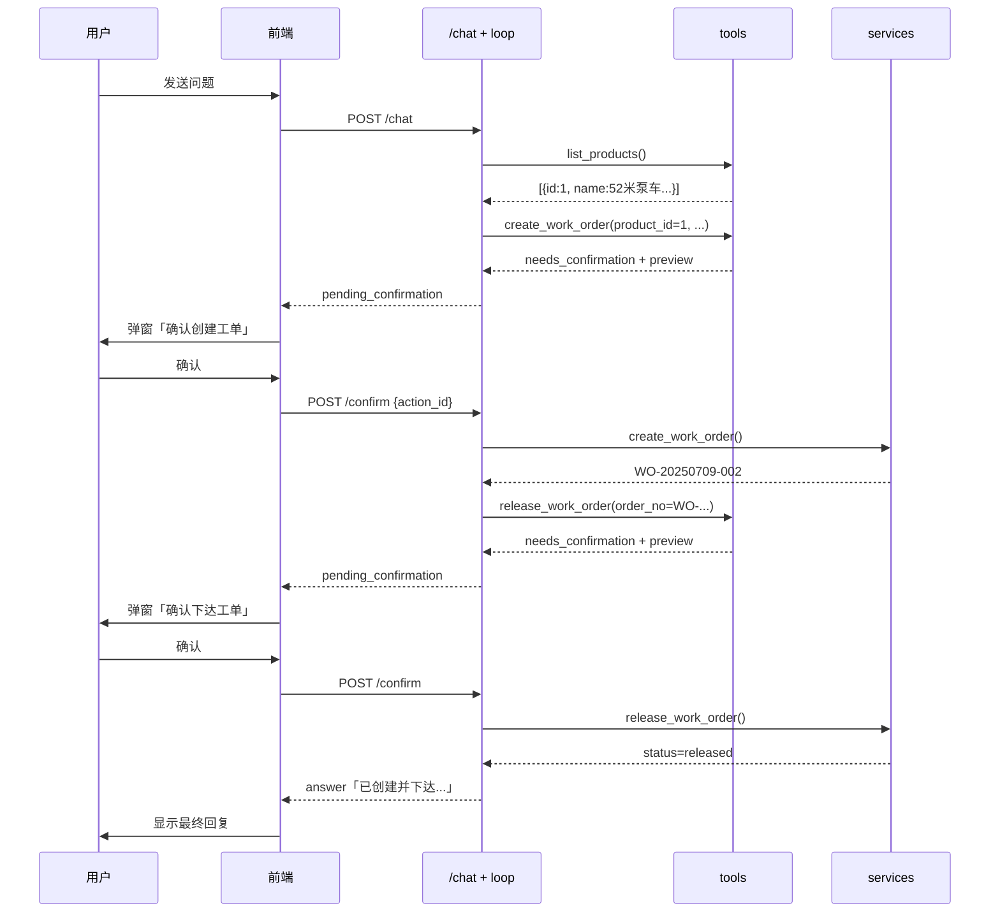

# 写操作与确认门详解 — MES 阶段 4（gaosi-tutor 未采用）

> **gaosi-tutor 说明：** 陪学项目 **无写操作确认门**（无 `confirm_store`、无 `/api/agent/confirm`）。  
> 本文档保留 MES 的 Human-in-the-loop 设计，供对照学习；业务示例（工单创建/下达）不适用于本项目。

> 本文档说明：MES 阶段 4 如何让 Agent 一句话完成「创建工单 + 下达」等多步写操作，以及 **Human-in-the-loop 确认门** 的设计与实现。  
> 配套代码：MES 仓库的 `tools.py`、`confirm_store.py`、`router.py`；非 gaosi-tutor 代码。

---

## 目录

1. [阶段 4 要解决什么问题](#1-阶段-4-要解决什么问题)
2. [和阶段 2/3 的区别](#2-和阶段-23-的区别)
3. [整体架构](#3-整体架构)
4. [新增工具](#4-新增工具)
5. [确认门：preview / execute 两态](#5-确认门preview--execute-两态)
6. [PendingAction 暂存](#6-pendingaction-暂存)
7. [Agent 主循环改动](#7-agent-主循环改动)
8. [API 设计](#8-api-设计)
9. [前端确认弹窗](#9-前端确认弹窗)
10. [走一遍完整例子](#10-走一遍完整例子)
11. [错误处理](#11-错误处理)
12. [局限与改进方向](#12-局限与改进方向)
13. [自测清单](#13-自测清单)

---

## 1. 阶段 4 要解决什么问题

阶段 2/3 的 Agent 只能**读**：

- 查工单（`get_work_order`）
- 列工单（`list_work_orders`）
- 搜 SOP（`search_sop`）

阶段 4 的目标：用户用**一句话**触发**多步写操作**，例如：

> 「给中建三局建一条 52 米泵车工单，数量 1，然后下达」

Agent 应自动完成：

```
list_products → create_work_order → release_work_order → 汇总回复
```

**但写操作会改数据库**，不能 LLM 一说就直接执行。因此阶段 4 的核心新增能力是：

1. **写操作工具** — 包装已有 `services.py` 业务逻辑
2. **确认门（Human-in-the-loop）** — 写操作前弹窗，用户点确认才真正执行
3. **多步工具链** — 创建完成后自动继续下达（可能再次弹窗确认）

---

## 2. 和阶段 2/3 的区别

| | 阶段 2/3 | 阶段 4 |
|--|---------|--------|
| 工具类型 | 只读（查库、检索） | 只读 + **写操作** |
| 调工具后 | 直接拿结果继续 | 写操作先 **preview**，等用户确认 |
| API | 只有 `/chat` | `/chat` + **`/confirm`** |
| 前端 | 展示回答和 tool_calls | 额外 **ElMessageBox 确认弹窗** |
| 业务逻辑 | Agent 层自己查 | 写操作复用 **`services.create_work_order`** 等 |

**设计原则：业务逻辑不重复写。** Agent 的 `tools.py` 只做参数转换、preview 摘要、确认门拦截；真正改库仍走 `services.py`（与 REST API `/api/work-orders` 同源）。

---

## 3. 整体架构

```
用户输入
   ↓
POST /api/agent/chat
   ↓
run_agent()                         ← loop.py
   ↓
LLM 选工具（可多轮，MAX_TURNS=8）
   ↓
execute_tool(allow_write=False)     ← tools.py
   ├─ 只读工具：直接查库，返回 ok:true
   └─ 写操作工具：返回 needs_confirmation + preview（不改库）
   ↓
save_pending()                      ← confirm_store.py（存对话上下文）
   ↓
返回 pending_confirmation 给前端
   ↓
用户点「确认执行」
   ↓
POST /api/agent/confirm { action_id }
   ↓
confirm_and_continue()              ← loop.py
   ├─ pop_pending → execute_tool(allow_write=True) → 真正改库
   └─ run_agent_from_messages() 继续 Agent（可能再次 needs_confirmation）
   ↓
最终 answer 或下一个 pending_confirmation
```

### 分层理解

```
┌─────────────────────────────────────────┐
│  前端 AgentChat.vue                      │
│  弹窗确认 → agentConfirm(action_id)      │
└───────────────────┬─────────────────────┘
                    ↓
┌─────────────────────────────────────────┐
│  Agent 层（loop / tools / confirm_store）│
│  工具包装、确认门、多步循环               │
└───────────────────┬─────────────────────┘
                    ↓
┌─────────────────────────────────────────┐
│  业务层 services.py（已有）              │
│  create_work_order / release_work_order  │
└─────────────────────────────────────────┘
```

---

## 4. 新增工具

阶段 4 在 `tools.py` 的 `TOOLS` 列表中新增 3 个工具：

| 工具 | 类型 | 包装 | 说明 |
|------|------|------|------|
| `list_products` | 只读 | `db.query(Product)` | 返回 id/code/name，创建工单前必须先查 |
| `create_work_order` | **写** | `services.create_work_order` | 创建工单 + 工位任务 + 发料单 |
| `release_work_order` | **写** | `services.release_work_order` | 下达工单（pending → released） |

### 为什么需要 list_products

LLM 不知道 `product_id`。用户说「52 米泵车」，Agent 必须先调 `list_products`，从返回列表里匹配名称，再拿 `product_id` 调 `create_work_order`。

```json
// list_products 返回示例
{
  "ok": true,
  "data": [
    {"id": 1, "code": "SY-5288THB", "name": "52米混凝土泵车"},
    {"id": 2, "code": "SY-6299THB", "name": "62米混凝土泵车"}
  ]
}
```

### create_work_order 参数

| 参数 | 类型 | 必填 | 说明 |
|------|------|------|------|
| `product_id` | int | 是 | 来自 list_products |
| `quantity` | int | 否 | 默认 1 |
| `customer` | string | 否 | 客户名，如「中建三局」 |
| `priority` | int | 否 | 1～10，默认 5 |

### release_work_order 参数

| 参数 | 类型 | 必填 | 说明 |
|------|------|------|------|
| `order_no` | string | 是 | 工单号，如 `WO-20250709-001` |

用 `order_no` 而不是 `order_id`，因为创建成功后 tool 结果里直接有工单号，LLM 更容易衔接下一步。

### 阶段 4 刻意不做的工具

- `issue_materials`（配送物料）— 留作后续扩展
- 对话里发「确认」让 LLM 理解 — 采用**前端弹窗 + 专用 `/confirm` 接口**，更安全

---

## 5. 确认门：preview / execute 两态

写操作工具内部有 `execute` 参数（对外由 `allow_write` 控制）：

```python
WRITE_TOOLS = frozenset({"create_work_order", "release_work_order"})

def execute_tool(name, arguments, db, *, allow_write=False) -> str:
    ...
    elif name == "create_work_order":
        result = tool_create_work_order(..., execute=allow_write)
```

### 第一次调用（preview，`allow_write=False`）

不改数据库，返回：

```json
{
  "ok": false,
  "status": "needs_confirmation",
  "preview": {
    "action": "create_work_order",
    "summary": "创建工单：52米混凝土泵车（SY-5288THB）× 1 台，客户：中建三局，优先级：5",
    "product_id": 1,
    "product_name": "52米混凝土泵车",
    "quantity": 1,
    "customer": "中建三局",
    "priority": 5
  }
}
```

### 用户确认后（execute，`allow_write=True`）

真正调用 `services.create_work_order`，返回：

```json
{
  "ok": true,
  "data": {
    "order_no": "WO-20250709-001",
    "id": 5,
    "status": "pending",
    "product_name": "52米混凝土泵车",
    "quantity": 1,
    "customer": "中建三局"
  }
}
```

**关键：`ok: false` 在 preview 阶段不代表失败**，而是「等待确认」。`loop.py` 通过 `status == "needs_confirmation"` 识别，而不是看 `ok`。

---

## 6. PendingAction 暂存

文件：`backend/app/agent/confirm_store.py`

当 loop 遇到 `needs_confirmation` 时，需要把**当前对话上下文**存起来，以便用户确认后能继续 Agent，而不是从头开始。

```python
@dataclass
class PendingAction:
    action_id: str          # UUID，给前端 /confirm 用
    tool: str               # 如 create_work_order
    arguments: dict         # LLM 传入的参数
    messages: list[dict]    # 暂停时的完整 messages（含 assistant tool_calls）
    tool_call_id: str       # 与 tool 消息配对的 id
    preview: dict           # 人类可读的摘要
```

- **存储位置**：进程内存 `_store` 字典
- **生命周期**：`save_pending()` 写入，`pop_pending()` 确认时取出并删除
- **重启后端**：全部丢失，`action_id` 失效

---

## 7. Agent 主循环改动

文件：`backend/app/agent/loop.py`

### 7.1 返回值改为 AgentRunResult

```python
@dataclass
class AgentRunResult:
    answer: str
    tool_trace: list[dict]
    pending_confirmation: dict | None = None
```

### 7.2 遇到 preview 时提前退出

```python
result_str = execute_tool(call.function.name, args, db, allow_write=False)
result = json.loads(result_str)

if result.get("status") == "needs_confirmation":
    action_id = save_pending(...)
    return AgentRunResult(
        answer="",
        tool_trace=tool_trace,
        pending_confirmation={...},
    )
```

此时 **不会** 把 tool 结果 append 到 messages，也 **不会** 继续调 LLM — 等用户确认。

### 7.3 confirm_and_continue 恢复执行

```python
def confirm_and_continue(action_id: str, db: Session) -> AgentRunResult:
    pending = pop_pending(action_id)
    result_str = execute_tool(pending.tool, pending.arguments, db, allow_write=True)
    # 把真实 tool 结果 append 到 pending.messages
    messages.append({"role": "tool", "tool_call_id": pending.tool_call_id, "content": result_str})
    # 从断点继续 Agent
    return run_agent_from_messages(messages, db)
```

若继续过程中 LLM 又调了写操作（如创建后的 `release_work_order`），会再次 `needs_confirmation`，前端再弹一次窗 — **链式确认**。

### 7.4 MAX_TURNS 调到 8

典型链路：`list_products` → `create`(preview) → 确认执行 → `release`(preview) → 确认执行 → 总结，需要足够轮次。

### 7.5 System Prompt 补充

`prompts.py` 的 `AGENT_SYSTEM_PROMPT` 增加写操作规则：

- 创建前必须先 `list_products`
- `needs_confirmation` 表示等待用户确认，**尚未执行**
- 只有 `ok: true` 才能说操作已完成

---

## 8. API 设计

### POST /api/agent/chat（已有，响应扩展）

**请求：**

```json
{ "question": "给中建三局建一条 52 米泵车工单，数量 1，然后下达" }
```

**响应（需要确认时）：**

```json
{
  "answer": "",
  "tool_calls": [
    {"tool": "list_products", "args": {}},
    {"tool": "create_work_order", "args": {"product_id": 1, "quantity": 1, "customer": "中建三局"}}
  ],
  "pending_confirmation": {
    "action_id": "a1b2c3d4-...",
    "action": "create_work_order",
    "summary": "创建工单：52米混凝土泵车（SY-5288THB）× 1 台，客户：中建三局，优先级：5",
    "details": { ... }
  }
}
```

### POST /api/agent/confirm（新增）

**请求：**

```json
{ "action_id": "a1b2c3d4-..." }
```

**响应：** 与 `/chat` 相同结构（`AgentConfirmOutput`）。可能：

- 返回最终 `answer`（全部完成）
- 或再次返回 `pending_confirmation`（如下达还需确认）

### Schema（schemas.py）

```python
class PendingConfirmationOut(BaseModel):
    action_id: str
    action: str
    summary: str
    details: dict = {}

class AgentConfirmInput(BaseModel):
    action_id: str
```

---

## 9. 前端确认弹窗

文件：`frontend/src/views/AgentChat.vue`、`frontend/src/api.js`

### 流程

1. `agentChat(question)` → 收到响应
2. 若有 `pending_confirmation`：
   - 助手气泡显示：`需要您的确认：{summary}`
   - `ElMessageBox.confirm(summary, '确认创建工单')`
3. 用户点「确认执行」→ `agentConfirm(action_id)`
4. 若 confirm 响应里还有 `pending_confirmation` → **递归**再弹窗（创建 → 下达）
5. 用户点「取消」→ 显示「已取消操作」，不改库

### api.js

```javascript
export const agentChat = (question) => api.post('/agent/chat', { question }).then(r => r.data)
export const agentConfirm = (action_id) => api.post('/agent/confirm', { action_id }).then(r => r.data)
```

### 为什么不用「对话里发确认」

| 方案 | 优点 | 缺点 |
|------|------|------|
| 对话「确认」 | 改动小 | LLM 可能误解、误触发写操作 |
| **弹窗 + /confirm**（本项目） | 确认是程序逻辑，不依赖 LLM | 前后端多写一点 |

---

## 10. 走一遍完整例子

用户：**「给中建三局建一条 52 米泵车工单，数量 1，然后下达」**



---

## 11. 错误处理

`execute_tool` 统一返回 `{"ok": false, "error": "..."}`：

| 场景 | error 示例 |
|------|-----------|
| 产品不存在 | `产品不存在` |
| 无工艺路线 | `产品未配置工艺路线` |
| 工单不存在 | `工单 WO-xxx 不存在` |
| 重复下达 | `只有待下达状态的工单可以下达` |
| action_id 过期 | `确认已过期或无效，请重新发起操作。` |

**原则：**

- 写操作失败后，把 error 作为 tool 结果 append 到 messages，让 LLM 组织人话告知用户
- **不要**在 loop 里自动 retry 写操作
- LLM 收到 error 后应停止后续写操作链

---

## 12. 局限与改进方向

| 局限 | 说明 | 改进方向 |
|------|------|---------|
| PendingAction 在内存 | 重启后 action_id 失效 | Redis / SQLite 持久化 |
| 用户取消不清理 store | 孤立 pending 占内存 | 取消时调 `/cancel` 或 TTL 过期 |
| 无操作审计日志 | 不知道谁确认的 | 阶段 5 加 logging |
| 未做权限控制 | 任何人可创建工单 | 接登录 + RBAC |
| 未含配送物料 | 只创建+下达 | 扩展 `issue_materials` 工具 |

---

## 13. 自测清单

```
[ ] list_products 返回 3 个产品
[ ] create_work_order preview 返回 needs_confirmation，数据库无新工单
[ ] /confirm 后工单出现，status=pending
[ ] release preview → confirm 后 status=released
[ ] 一句话「创建并下达」触发 3+ 步工具链（list + create + release）
[ ] 对已下达工单再 release 返回 error，不崩溃
[ ] 用户点取消，数据库无变更
[ ] 只读问题（查进度、SOP）不弹窗
[ ] 重启后端后旧 action_id 返回「确认已过期」
```

### 推荐体验步骤

1. 启动 `./start.sh`，打开 http://localhost:5173/agent-chat
2. 点示例：**「给中建三局建一条 52 米泵车工单，数量 1，然后下达」**
3. 依次确认两次弹窗
4. 到工单列表页验证新工单状态为 **已下达**
5. 对照本文档第 10 节时序图，读 `loop.py` 的 `confirm_and_continue`

---

## 文件对照

```
backend/app/agent/
├── tools.py              ← 新增 list_products / create / release；WRITE_TOOLS
├── confirm_store.py      ← PendingAction 内存暂存
├── loop.py               ← needs_confirmation 暂停；confirm_and_continue
├── router.py             ← POST /confirm
├── prompts.py            ← 写操作规则
└── ...

backend/app/schemas.py    ← PendingConfirmationOut, AgentConfirmInput/Output

frontend/src/
├── api.js                ← agentConfirm()
└── views/AgentChat.vue   ← ElMessageBox 链式确认
```

---

> 相关文档：[Agent 学习路线](./agent-learning-roadmap.md) · [Function Calling](./agent-function-calling.md) · [MES 数据模型](./mes-data-model.md)
