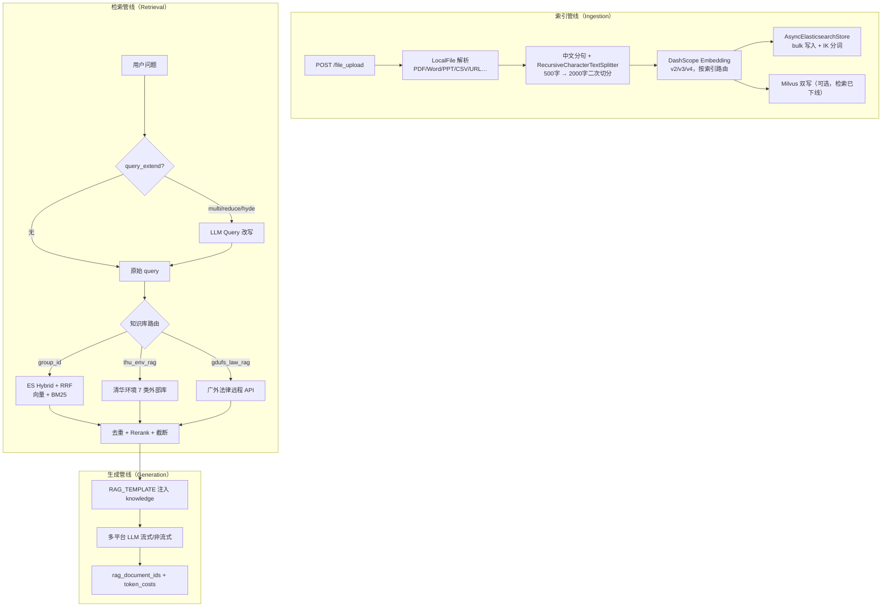
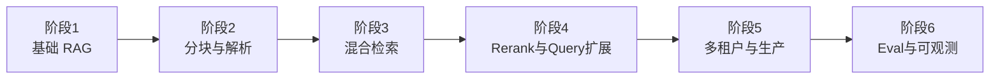

# 企业级 RAG 分析与开发路线

> **公司项目**：`/Users/thomas/xt_code/chat-test`（学堂在线 · 多模型 Chat API + RAG 中间层）  
> **个人项目**：`gaosi-tutor`（家庭笔记 RAG，Chroma + 本地 Embedding）  
> **目的**：提炼简历素材 + 规划从 Demo 到企业级的 RAG 学习/落地路线

---

## 一、chat-test 项目 RAG 实现总结

### 1.1 项目定位

`chat-test` 是学堂在线内部的 **LLM 统一网关 + RAG 知识库服务**：

- 封装 10+ 家大模型 API（OpenAI、智谱、阿里、百度、豆包、DeepSeek 等）
- 对内提供 **文档索引、混合检索、Rerank、RAG 对话** 能力
- 服务课程平台、智能体等业务方，版本标签 `0.1.x` → `0.8.8`，**长期生产迭代**

### 1.2 技术架构总览



### 1.3 核心模块对照表

| 环节 | 文件路径 | 实现要点 |
|------|----------|----------|
| **文档解析** | `rag/local_file.py` | md/txt/pdf/docx/xlsx/pptx/eml/csv/url；Unstructured + PyMuPDF |
| **中文分块** | `rag/text_spliter/chinese_text_spliter.py` | 按中英文标点分句，默认 500 字 |
| **二次切分** | `rag/local_file.py` | LangChain `RecursiveCharacterTextSplitter`，chunk_size=2000 |
| **Embedding** | `rag/embedding/dashcope.py` | 阿里云 DashScope v2/v3/v4，batch + tenacity 重试 |
| **模型路由** | `rag/embedding/manager.py` | MySQL `index_embedding_model_map`，30s 本地缓存 |
| **向量存储** | `rag/vector_store/async_es_store.py` | 自研异步 ES Store，IK 分词，版本化 index + alias |
| **检索编排** | `rag/es.py` | Hybrid + RRF，细粒度 metadata 过滤 DSL |
| **Query 扩展** | `rag/query_processing.py` | Multi-query / Reduce / HyDE |
| **Rerank** | `rag/reranker/zhipu_rerank_api.py` | 智谱 Rerank API（生产默认） |
| **RAG 编排** | `rag/rag_api.py` | `get_rag_prompt()` 联邦检索 + prompt 组装 |
| **联邦 KB** | `rag/third_api/thu_env_search.py` | 课程/学术/专利/ESG/报告/标准/互联网 |
| **联邦 KB** | `rag/third_api/gdufs_apis.py` | 广外法律库远程 retrieval + rerank |
| **API 入口** | `apps/inner/view.py` | `/talk_with_rag`、`/file_upload`、`/search_db` |

### 1.4 企业级设计亮点（简历可写）

#### ① 自研 Async ES Vector Store

扩展 LangChain `ElasticsearchStore`，支持：
- 异步 bulk 写入（高吞吐索引）
- IK 中文分词（`ik_max_word`）
- 版本化索引 + alias（`{index}_v3` → alias，支持 embedding 模型升级）
- 预计算 embedding 直写（索引时 embed，检索时不再重复计算）

#### ② Hybrid Retrieval + RRF

```python
# rag/es.py
ElasticsearchStore.ApproxRetrievalStrategy(
    hybrid=True,
    rrf={"window_size": max(10, top_k)}
)
```

向量检索 + BM25 关键词检索，RRF 融合排序——比纯向量 recall 更高。

#### ③ 多租户 Metadata 过滤 DSL

`rag/es.py` 中组合 ES bool query，支持：
- 软删除 / 开放状态过滤
- 智能体 `source_type` + `source_id` 权限隔离
- **基础库 vs 增强库**切换（`chunk_source` + `is_open_status_dict`）
- 多 `group_id` 并发检索

#### ④ Embedding 模型 per-index 路由

MySQL 映射表 `index_embedding_model_map`：每个 ES 索引绑定 embedding 模型版本（v2 1536维 / v3 1024维），避免维度不匹配。30s 本地缓存减少 DB 查询。

#### ⑤ 联邦 RAG 编排

单一 `get_rag_prompt()` 通过 `group_id` 特殊值路由：
- 本地 ES 知识库
- 清华环境 7 类外部库（`asyncio.gather` 并发）
- 广外法律库远程 API

#### ⑥ Query 扩展策略

| 策略 | 作用 | Token 成本 |
|------|------|-----------|
| **Multi-query** | LLM 生成多个检索 query，提升 recall | 高 |
| **Reduce** | 长问题拆成子 query | 中 |
| **HyDE** | 生成假设性文档再检索 | 高 |

#### ⑦ 端到端 Token 成本归因

`embedding_tokens` + `rerank_tokens` + LLM tokens 三层统计，贯穿 API 响应——生产计费必需。

#### ⑧ 引用溯源

流式响应携带 `rag_document_ids`，前端可展示引用来源。

### 1.5 与 Demo 级 RAG 的差距（chat-test 已有 vs 仍缺）

| 维度 | chat-test 已有 ✅ | 仍缺 / 工程债 ⚠️ |
|------|------------------|-----------------|
| 多租户隔离 | group_id + metadata ACL | — |
| 中文优化 | IK 分词 + 中文分句器 | — |
| 混合检索 | ES hybrid + RRF | Milvus 检索路径已注释 |
| 模型治理 | per-index embedding 映射 + alias | 迁移脚本 `pass` 未完成 |
| Rerank | 智谱 API（生产） | 本地 BCE 模型禁用（8 worker × 2GB） |
| 可观测性 | 结构化 JSON 日志 + 分阶段耗时 | 无 Prometheus / Langfuse / RAGAS |
| Eval | — | 无 golden set、无 retrieval 命中率指标 |
| 测试 | — | 无 RAG 单元/集成测试 |
| 文档 | — | README 为 GitLab 模板 |

**结论**：核心检索/索引/多租户设计已达生产级；eval、可观测性、备用链路是主要工程债。

---

## 二、简历包装素材

### 2.1 项目描述（可直接粘贴）

```
学堂在线 · 多模型 Chat API + RAG 知识库服务（chat-test）
Python / FastAPI / LangChain / Elasticsearch / DashScope

· 设计并实现企业级 RAG 中间层，服务课程平台、智能体等多业务方，版本迭代 0.1→0.8.8
· 自研 AsyncElasticsearchStore：异步 bulk 索引、IK 中文分词、版本化 index alias、预计算 embedding
· 实现 ES Hybrid Retrieval + RRF 融合排序，结合向量与 BM25 提升 recall
· 构建多租户 metadata 过滤 DSL：软删除、权限隔离、基础库/增强库切换、智能体 source 隔离
· 实现 Embedding 模型 per-index 路由（MySQL 映射 + 缓存），支持 v2/v3 多版本共存
· 编排联邦 RAG：本地 ES + 清华环境 7 类外部库 + 广外法律库，asyncio 并发检索
· 集成 Multi-query / HyDE Query 扩展、智谱 Rerank API，端到端 token 成本归因与引用溯源
```

### 2.2 面试可讲的 5 个技术点

| # | 话题 | 你怎么讲 |
|---|------|----------|
| 1 | **为什么选 ES 而不是 Milvus？** | ES 同时做向量 + BM25 混合检索 + metadata 过滤 + IK 分词，一个引擎解决检索+过滤；Milvus 仅作双写备份 |
| 2 | **Hybrid + RRF 怎么工作？** | 向量检索和关键词检索各出 top-K，RRF 按排名倒数加权融合，比单向量 recall 高，尤其对专业术语 |
| 3 | **多租户怎么隔离？** | `group_id` 逻辑租户 + ES metadata 过滤（deleted/is_open/source_type/chunk_source），bool query 组合 |
| 4 | **Embedding 模型升级怎么办？** | 新索引 `{name}_v4` + alias 切换，MySQL 映射表记录每索引对应模型，迁移脚本从 ES mapping 维度推断 |
| 5 | **Query 扩展的取舍？** | Multi-query 提升 recall 但多花 LLM token；默认关闭，业务方可通过 `query_extend` 参数开启 |

### 2.3 与个人项目 gaosi-tutor 的对比（面试加分）

| 维度 | chat-test（企业） | gaosi-tutor（个人） |
|------|-------------------|---------------------|
| 向量库 | Elasticsearch（混合检索） | Chroma（纯向量） |
| Embedding | DashScope API（云端） | fastembed 本地模型 |
| 分块 | 中文分句 + RecursiveCharacter 双层 | 按段落切块 |
| 检索 | Hybrid + RRF + Rerank | 纯向量 Top-K |
| 多租户 | group_id + metadata ACL | lesson_id 过滤 |
| Query 扩展 | Multi/Reduce/HyDE | 无 |
| 联邦检索 | 3 类外部 KB | 无 |
| 可观测性 | 结构化日志 + token 计费 | smoke 脚本 |
| 适用场景 | 企业知识库、课程平台 | 家庭陪学笔记 |

**面试话术**：

> 公司项目让我理解了企业 RAG 的完整管线——混合检索、多租户、Rerank、联邦 KB。个人项目 gaosi-tutor 是我用更轻量的栈（Chroma + 本地 Embedding）复刻核心链路，两者互补：一个深度、一个广度。

---

## 三、企业级 RAG 开发路线

> 从「能跑」到「能上线」到「能量化」，分 6 个阶段。  
> 每阶段标注：chat-test 已覆盖 ✅、gaosi-tutor 已覆盖 ✅、待学习/实践 📋

### 总览



---

### 阶段 1：基础 RAG 管线（1～2 周）

**目标**：文档 → 切块 → Embedding → 向量库 → 检索 → 注入 Prompt → LLM 生成

| 能力 | chat-test | gaosi-tutor | 学习要点 |
|------|-----------|-------------|----------|
| 文档加载 | ✅ 10+ 格式 | 📋 仅文本笔记 | LangChain Document / Loader |
| 切块 | ✅ 双层切分 | ✅ 段落切块 | chunk_size、overlap、按结构切 |
| Embedding | ✅ DashScope API | ✅ fastembed 本地 | API vs 本地权衡 |
| 向量库 | ✅ ES | ✅ Chroma | 选型：ES/Milvus/Chroma/Qdrant |
| 检索 Tool | ✅ `/search_db` | ✅ `search_family_notes` | Agent Tool 封装 |
| Prompt 注入 | ✅ RAG_TEMPLATE | ✅ system prompt | 引用格式、幻觉控制 |

**实践任务（gaosi-tutor）**：
- [x] 家庭笔记 RAG 基础管线
- [ ] 支持上传 txt/md 文件索引（扩展 `local_file` 式解析）
- [ ] 检索结果注入 prompt 时带来源标注

**验收**：`make smoke-rag` 通过；能口述完整数据流。

---

### 阶段 2：文档解析与分块策略（1～2 周）

**目标**：不同文档类型的解析质量决定 RAG 上限

| 能力 | chat-test | gaosi-tutor | 学习要点 |
|------|-----------|-------------|----------|
| PDF 解析 | ✅ PyMuPDF | 📋 | 表格/图片/公式处理 |
| Word/PPT | ✅ Unstructured | 📋 | 保留结构信息 |
| 中文分句 | ✅ 自定义 splitter | 📋 | 标点规则、最小长度 |
| 二次切分 | ✅ RecursiveCharacter 2000 | 📋 | 大段落二次拆分 |
| 内容清洗 | ✅ 去图片/markdown 标题 | 📋 | `clean_content()` |
| CSV 行级 | ✅ 自定义 loader | 📋 | 空值继承 |

**chat-test 参考代码**：
- `rag/local_file.py` — 统一解析入口
- `rag/text_spliter/chinese_text_spliter.py` — 中文分句
- `rag/vector_store/async_es_store.py` — `clean_content()`

**实践任务**：
- [ ] gaosi-tutor 增加中文分句器（参考 chat-test）
- [ ] 长笔记自动二次切分
- [ ] 记录每 chunk 的 `has_img` / `chunk_source` 等 metadata

**验收**：同一篇长笔记，分块后检索命中率可感知提升。

---

### 阶段 3：混合检索与 Rerank（2～3 周）

**目标**：从「纯向量」升级到「混合检索 + 重排序」

| 能力 | chat-test | gaosi-tutor | 学习要点 |
|------|-----------|-------------|----------|
| 向量检索 | ✅ ES kNN | ✅ Chroma cosine | Top-K、min_score |
| 关键词检索 | ✅ ES BM25 + IK | 📋 | BM25、中文分词 |
| 混合融合 | ✅ RRF | 📋 | Reciprocal Rank Fusion |
| Rerank | ✅ 智谱 API | 📋 | 交叉编码器 vs API |
| 去重 | ✅ `unique_documents` | 📋 | 内容级去重 |
| 上下文截断 | ✅ `reduce_results` | 📋 | token/字符预算裁剪 |

**chat-test 参考代码**：
- `rag/es.py:141-152` — Hybrid + RRF 配置
- `rag/reranker/zhipu_rerank_api.py` — Rerank API 封装
- `rag/rag_api.py:146-159` — `reduce_results()` 截断

**实践任务**：
- [ ] gaosi-tutor 增加 BM25 关键词检索（可用 `rank_bm25` 库）
- [ ] 实现简单 RRF 融合（向量 + BM25 排名合并）
- [ ] 接入 Rerank API（智谱 / 阿里 gte-rerank）或本地 cross-encoder
- [ ] 检索结果按 token 预算截断后再注入 prompt

**验收**：同一 query，混合检索 vs 纯向量，bad case 减少可量化。

---

### 阶段 4：Query 扩展与联邦检索（2 周）

**目标**：提升 recall + 支持多数据源

| 能力 | chat-test | gaosi-tutor | 学习要点 |
|------|-----------|-------------|----------|
| Multi-query | ✅ LLM 生成多 query | 📋 | recall ↑，成本 ↑ |
| HyDE | ✅ 假设文档检索 | 📋 | 适合语义差距大的场景 |
| Reduce | ✅ 长问题拆分 | 📋 | 复杂问题分解 |
| 联邦 KB | ✅ 3 类外部库 | 📋 | `asyncio.gather` 并发 |
| 多索引 | ✅ 逗号分隔 group_id | 📋 | 跨知识库检索 |

**chat-test 参考代码**：
- `rag/query_processing.py` — 三种 query 扩展
- `rag/rag_api.py` — 联邦编排 + `asyncio.gather`
- `rag/third_api/` — 外部 KB 适配器模式

**实践任务**：
- [ ] gaosi-tutor 实现 Multi-query（可选开启）
- [ ] 设计「外部 API 检索适配器」接口（为未来扩展预留）
- [ ] 检索时支持跨多讲次并发查询

**验收**：开启 Multi-query 后，模糊问题的 recall 提升可感知。

---

### 阶段 5：多租户、权限与生产部署（2～3 周）

**目标**：从单用户 Demo 到多业务方生产服务

| 能力 | chat-test | gaosi-tutor | 学习要点 |
|------|-----------|-------------|----------|
| 多租户 | ✅ group_id | 📋 lesson_id | 逻辑隔离 |
| Metadata ACL | ✅ 软删除/开放/权限 | 📋 | ES bool query 组合 |
| 基础库/增强库 | ✅ chunk_source 切换 | 📋 | 分层知识管理 |
| Embedding 版本管理 | ✅ per-index 映射 + alias | 📋 | 模型升级不停服 |
| Token 计费 | ✅ 三层统计 | 📋 | embedding/rerank/LLM |
| 引用溯源 | ✅ rag_document_ids | 📋 | 前端展示来源 |
| 索引 API | ✅ create/update/delete | ✅ PATCH 自动索引 | 增量 vs 全量 |
| 部署 | ✅ Docker 8 workers | 📋 | 容器化、健康检查 |
| 安全 | ✅ IP 白名单 | 📋 | 内网 API 鉴权 |

**chat-test 参考代码**：
- `rag/es.py:154-216` — metadata 过滤 DSL
- `rag/embedding/manager.py` — per-index 模型路由
- `apps/inner/view.py` — `/file_upload` 索引 API
- `db/model.py` — `IndexEmbeddingModelMap`

**实践任务**：
- [ ] gaosi-tutor Docker 一键部署
- [ ] 检索日志结构化（query、hits、score、latency）
- [ ] 索引 delete/update 增量重建（已有单讲索引）
- [ ] API 响应返回引用 chunk ID

**验收**：能画多租户 metadata 过滤的 bool query 图；Docker 部署可演示。

---

### 阶段 6：Eval、可观测性与持续迭代（持续）

**目标**：证明 RAG 好用、出问题能查——区分 Demo 与生产的分水岭

| 能力 | chat-test | gaosi-tutor | 学习要点 |
|------|-----------|-------------|----------|
| Golden Set | ⚠️ 无 | 📋 | 50～100 条标注问答 |
| Retrieval 命中率 | ⚠️ 无 | 📋 | 期望 chunk 是否命中 |
| Answer 质量评测 | ⚠️ 无 | 📋 | LLM-as-Judge |
| RAGAS 框架 | ⚠️ 无 | 📋 | faithfulness、relevance |
| 结构化日志 | ✅ JSON 日志 | 📋 | query + results + latency |
| Trace | ⚠️ 无 | 📋 | Langfuse / 自建 |
| Prometheus | ⚠️ 无 | 📋 | QPS、P95、错误率 |
| A/B 对比 | ⚠️ 无 | 📋 | 不同 chunk/rerank 策略 |
| 单元测试 | ⚠️ 无 | 📋 | 切块、检索、索引 |

**实践任务**：
- [ ] 先读概念：[rag-eval.md](./rag-eval.md)（Precision@K / MRR / 黄金集）
- [ ] gaosi-tutor 建立 `scripts/eval/rag_golden.jsonl`
- [ ] 批量跑检索，统计 Recall@K / Precision@K / MRR
- [ ] 接入 Langfuse 或自建 trace 表
- [ ] CI 中加入 `make smoke-rag` 回归

**验收**：有一份 Eval 报告：Recall@3、平均延迟、bad case 清单。

---

## 四、学习路线时间规划

| 周次 | 阶段 | 产出 | 简历可写 |
|------|------|------|----------|
| 第 1～2 周 | 阶段 1 基础 RAG | gaosi-tutor RAG 跑通 | ✅ 已完成 |
| 第 3～4 周 | 阶段 2 分块策略 | 中文分句 + 二次切分 | 文档解析与分块优化 |
| 第 5～7 周 | 阶段 3 混合检索 | BM25 + RRF + Rerank | 混合检索 + 重排序 |
| 第 8～9 周 | 阶段 4 Query 扩展 | Multi-query + 联邦模式 | Query 扩展策略 |
| 第 10～12 周 | 阶段 5 生产化 | Docker + 日志 + 引用溯源 | 多租户 RAG 服务 |
| 第 13 周+ | 阶段 6 Eval | Golden set + Recall 报告 | RAG 评测与可观测性 |

---

## 五、技术选型决策树

面试常问「为什么选 X 不选 Y」，提前准备：

### 向量库选型

```
文档量 < 10万 + 单机 + 快速验证？
  → Chroma / Qdrant（gaosi-tutor 路径）

需要混合检索（向量 + BM25）+ 复杂 metadata 过滤？
  → Elasticsearch（chat-test 路径）

纯向量 + 超大规模 + 低延迟？
  → Milvus / Qdrant

低代码快速原型？
  → Dify 内置向量库
```

### Embedding 选型

```
有云端 API Key + 要最好效果？
  → DashScope / OpenAI text-embedding-3

要离线 / 无 API 成本 / 数据不出本地？
  → fastembed / sentence-transformers（gaosi-tutor 路径）

多版本共存 / 需要升级不停服？
  → per-index 模型映射 + ES alias（chat-test 路径）
```

### Rerank 选型

```
要最好效果 + 可接受 API 成本？
  → 智谱 / 阿里 gte-rerank API（chat-test 路径）

要离线 + 可接受内存？
  → BCE / cross-encoder 本地模型（注意 worker 内存）

预算有限 / 召回已够？
  → 跳过 Rerank，靠 hybrid + 调 top_k
```

---

## 六、与求职路线的关系

| 文档 | 侧重 |
|------|------|
| [agent-job-roadmap.md](./agent-job-roadmap.md) | Agent 开发工程师全貌 |
| [agent-learning-path.md](./agent-learning-path.md) | gaosi-tutor 项目学习 |
| **本文档** | RAG 专项：公司经验提炼 + 企业级路线 |

**简历组合策略**：

> **公司项目（chat-test）** 证明你做过 **生产级、多租户、混合检索** 的企业 RAG；  
> **个人项目（gaosi-tutor）** 证明你能 **从 0 独立实现** RAG 管线并持续迭代。

两者叠加，覆盖 JD 中 ~60% 的 RAG 相关要求。

---

## 七、相关代码索引（chat-test）

| 模块 | 路径 |
|------|------|
| RAG 编排入口 | `rag/rag_api.py` |
| ES 检索 + 过滤 | `rag/es.py` |
| 异步 ES Store | `rag/vector_store/async_es_store.py` |
| 文档解析 | `rag/local_file.py` |
| 中文分句 | `rag/text_spliter/chinese_text_spliter.py` |
| Embedding | `rag/embedding/dashcope.py` + `manager.py` |
| Query 扩展 | `rag/query_processing.py` |
| Rerank | `rag/reranker/zhipu_rerank_api.py` |
| 联邦 KB | `rag/third_api/thu_env_search.py` + `gdufs_apis.py` |
| API 入口 | `apps/inner/view.py` |
| 请求 Schema | `apps/inner/schema.py` → `RagRequest` |
| 配置 | `core/settings.py` |

---

## 八、一句话总结

> **企业级 RAG = 解析分块 + 混合检索 + Rerank + 多租户 + Query 扩展 + Token 计费 + Eval**

chat-test 已覆盖前 6 项（生产验证），gaosi-tutor 覆盖了第 1 项（独立实现）。按本文档阶段 2～6 在 gaosi-tutor 上逐步补齐，就能把「公司经验」转化为「可演示、可度量、可面试」的完整 RAG 能力栈。
